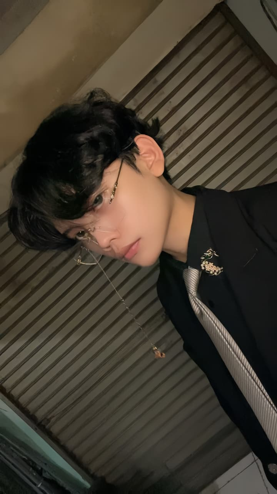

# Lab1Web
Praktikum Pemrograman Web 1
Penjelasan dan langkah-langkah praktikum pemrograman web 1
1. Dimulai dari membuka software text editor seperti sublime text, vscode atau yang lainnya. Namun disini kita akan menggunakan Text editor VSCode.
.
2. Buka/Run VSCode lalu buat folder baru yang bernama Lab1Web, setelah dibuat buka folder tersebut di VSCode,lalu buat file HTML dengan nama index.html.

.

4. File index.html sudah dibuat sekarang lanjut ke pembuatan struktur dasar HTML dengan code sebagai berikut: 
<!DOCTYPE html>
<html lang="en">
<head>
   <meta charset="UTF-8">
   <meta name="viewport" content="width=device-width, initial-scale=1.0">
   <title>Document</title>
</head>
<body>
   
</body>
</html>
Simpan file tersebut lalu buka di browser. .

4. Lanjut untuk pembuatan paragraf menggunakan code sebagai berikut:
  

        Nama: Alleizandro Lim Hianto Prasetya
  

  

        Saya sedang mempelajari dasar-dasar pengembangan
        aplikasi web menggunakan HTML.
    

  maka akan muncul nama tersebut pada halaman web di browser

5. Lanjut untuk pembuatan judul dan sub judul dengan menggunakan code sebagai berikut:
<h1>Data Diri</h1>
<h2>Keahlian</h2>
ditambah dengan code paragraf sebelumnya maka ketika mencoba membuka di browser akan muncul judul dan sub judul pada halaman web.
6. Sekarang untuk menyisipkan atau menempelkan gambar pada halaman browser dengan menambah element tag yaitu "img" sebagai code untuk menyisipkan gambar, "src" sebagai lokasi gambar berada, "alt" judul atau nama keterangan dari gambar tersebut dan "width" mengatur ukuran gambar.

hasil dari code yang telah kita buat

7. Menambah hyperlink yang dimana kita bisa menampilkan konten yang ingin disisipkan baik berupa gambar atau web baik dari internal maupun eksternal.
<nav><a href="index.html">Beranda</a>
        <a href="halaman2.html">Halaman 2</a>
        <a href="https://pelitabangsa.ac.id/">About University</a>
</nav>
maka akan muncul text berwarna biru bergaris bawah yang dimana jika kita mengklik text tersebut maka halaman akan berubah secara otomomatis sesuai dengan link yang kita tempelkan pada code tersebut 

8. Penambahan list dan komentar pada struktur HTML, penambahan list menggunakan unordered list, ordered list dan komentar bisa menggunakan code sebagai berikut:
 <!-- Bagian Keahlian -->
    <h2>Keahlian</h2>
    <ul>
      <li >HTML</li>
      <li >Python</li>
    </ul>
    <!-- Capaian Pembelajaran -->
    <h2>Target Belajar</h2>
    <ol>
        <li>Menguasai JavaScript</li>
        <li>Menguasai HTML</li>
        <li>Menguasai CSS</li>
        <li>Menguasai Python</li>
        <li>Menguasai C++</li>
    </ol>
    
    Dengan penggunaan code tersebut maka kalimat Bagian Keahlian & Capaian Pembelajaran tidak akan muncul pada halaman web dan hanya berfungsi sebagai penanda pada code tersebut namun untuk penggunaan list akan muncul pada halaman web tersebut.
    
    
10. Maka terakhir setelah selesai membuat struktur dan code HTML yang sudah kita buat maka secara keseluruhan, tampilan web akan menampilkan hasil dari pembuatan code yang kita buat.

